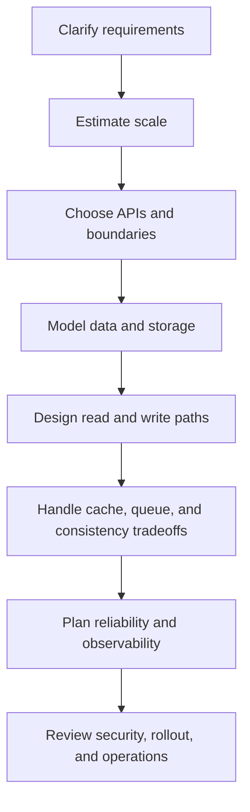

# system-design-checklist

English | [简体中文](./README.zh-CN.md)

A practical **system design checklist** for backend engineers who want a reusable framework for:

- system design interviews
- architecture reviews
- service design docs
- production readiness discussions
- backend / distributed-systems self-study

This repo is intentionally checklist-first: concise enough to use during design discussions, but detailed enough to expose real engineering tradeoffs.

## What you get

- a reusable checklist for backend / distributed-systems design
- a lightweight design-doc template you can fill in quickly
- a short tradeoff sheet for architecture reviews
- review prompts for interviews and technical design discussions
- a one-page answer sheet you can keep beside you during interviews and reviews
- worked examples that show how to apply the checklist in practice

## Why this repo exists

A lot of "system design" material is either:

- too high-level to help you make implementation decisions, or
- too interview-gimmicky to be useful in real engineering work

This repo aims for a better middle ground:

- **practical, not performative**
- **backend-oriented, not whiteboard-only**
- **useful in interviews and real service design**
- **focused on tradeoffs, failure modes, and operations**

## How to use it

Use this checklist when you need to design or review a service.

1. Clarify scope and constraints
2. Sketch the request / event flow
3. Walk the checklist section by section
4. Write down explicit tradeoffs and risks
5. End with operations and rollout readiness

## Design flow at a glance

## Common use cases

### System design interviews

Use the checklist to keep your answer structured so you don't forget scale, failure modes, consistency, or operations.

### Architecture reviews

Use the checklist as a review aid when you want to challenge assumptions, surface tradeoffs, and find the parts that will be painful to operate later.

### Service design docs

Use the checklist and template together when writing a lightweight design doc for a new service, feature, or subsystem.

## The checklist

### 1. Problem framing

- [ ] What is the primary user or business outcome?
- [ ] What is explicitly **in scope** and **out of scope**?
- [ ] What are the latency, throughput, durability, and consistency expectations?
- [ ] Is this an online serving system, an async pipeline, or a hybrid?
- [ ] What assumptions are we making that could break later?

### 2. Requirements and constraints

- [ ] What are the functional requirements?
- [ ] What are the non-functional requirements?
- [ ] What availability target matters here?
- [ ] What data-loss tolerance exists?
- [ ] Are there regulatory, privacy, or audit constraints?
- [ ] Are there cost or team-ownership constraints?

### 3. Scale estimation

- [ ] QPS / RPS expectations?
- [ ] Read/write ratio?
- [ ] Peak traffic multiplier?
- [ ] Storage growth over 6–12 months?
- [ ] Hot-key, tenant-skew, or burstiness risks?
- [ ] Cross-region or cross-AZ requirements?

### 4. API and boundary design

- [ ] What are the service boundaries?
- [ ] Is REST, RPC, async messaging, or a hybrid more appropriate?
- [ ] What request/response contracts must remain stable?
- [ ] What idempotency guarantees are required?
- [ ] How are pagination, filtering, retries, and errors handled?
- [ ] What ownership boundary exists between this service and upstream/downstream systems?

### 5. Data model and storage

- [ ] What are the core entities and relationships?
- [ ] What access patterns dominate?
- [ ] Does relational storage fit, or do we need KV/document/search/time-series storage?
- [ ] Which indexes are required for expected queries?
- [ ] What are the partitioning / sharding keys?
- [ ] What schema evolution or migration risks exist?

### 6. Read path design

- [ ] What happens on a normal read request?
- [ ] What can be cached?
- [ ] Where should caching live: client, CDN, service, or storage-side?
- [ ] What happens on cache miss, stampede, or hot key?
- [ ] How is degraded read behavior defined?

### 7. Write path design

- [ ] What happens on create / update / delete?
- [ ] Is synchronous confirmation required?
- [ ] Where can buffering or queuing help?
- [ ] What are the retry semantics?
- [ ] What prevents duplicate effects?
- [ ] What is the failure mode if downstream work partially succeeds?

### 8. Async workflows, queues, and events

- [ ] Do we need a queue, stream, or event bus?
- [ ] What ordering guarantees actually matter?
- [ ] What is the retry strategy?
- [ ] Is a dead-letter queue needed?
- [ ] How are poison messages detected and handled?
- [ ] How will operators replay or backfill safely?

### 9. Consistency and correctness

- [ ] Where do we need strong consistency vs eventual consistency?
- [ ] What invariants must never be violated?
- [ ] How are race conditions prevented or tolerated?
- [ ] What deduplication / idempotency key is required?
- [ ] How do transactions, locks, or compensating actions fit here?

### 10. Reliability and resilience

- [ ] What are the main failure domains?
- [ ] What happens if a dependency times out or returns errors?
- [ ] Where do we need timeouts, backoff, circuit breaking, or bulkheads?
- [ ] What is the blast radius of bad deploys or malformed traffic?
- [ ] What graceful-degradation path exists?
- [ ] How do we recover after partial outage or data backlog?

### 11. Observability and operations

- [ ] What logs are necessary for incident response?
- [ ] What metrics define healthy behavior?
- [ ] What traces or spans will explain latency?
- [ ] Which SLIs / SLOs matter?
- [ ] What dashboards and alerts should exist on day one?
- [ ] What runbooks or playbooks are needed?

### 12. Security and abuse resistance

- [ ] What authn / authz checks are required?
- [ ] What secrets and sensitive data exist?
- [ ] Is PII encrypted and access-controlled appropriately?
- [ ] What rate limiting or abuse controls are needed?
- [ ] What auditability requirements exist?
- [ ] What data-retention or deletion obligations exist?

### 13. Delivery and rollout

- [ ] How will this be deployed safely?
- [ ] Can it be canaried or rolled out progressively?
- [ ] Are schema / config / code changes compatible across versions?
- [ ] What rollback strategy exists?
- [ ] How will we validate success after launch?

### 14. Review questions before sign-off

- [ ] What is the simplest version that still solves the real problem?
- [ ] Which assumption is most likely to fail first?
- [ ] Where are we over-engineering?
- [ ] What will be painful to operate six months from now?
- [ ] What should we explicitly defer to a later phase?

## Extra templates

- [`docs/service-design-template.md`](./docs/service-design-template.md) — lightweight design-doc structure
- [`docs/common-tradeoffs.md`](./docs/common-tradeoffs.md) — common backend tradeoffs worth calling out explicitly
- [`docs/review-questions.md`](./docs/review-questions.md) — practical review prompts for interviews or architecture reviews
- [`docs/examples/url-shortener.md`](./docs/examples/url-shortener.md) — worked example for a classic read-heavy interview problem
- [`docs/examples/notification-service.md`](./docs/examples/notification-service.md) — worked example for an async, fan-out-heavy backend system

## Worked examples

If you want to see the checklist applied end-to-end instead of just reading prompts:

- **[URL shortener example](./docs/examples/url-shortener.md)** — request flow, storage model, hot-key/cache behavior, and operational tradeoffs
- **[Notification service example](./docs/examples/notification-service.md)** — event ingestion, fan-out workers, retries, preferences, and provider failure handling

## One-page answer sheet

If you want a shorter prompt sheet that you can keep open during an interview or design review:

- [`docs/system-design-answer-sheet.md`](./docs/system-design-answer-sheet.md) — compact English version
- [`docs/system-design-answer-sheet.zh-CN.md`](./docs/system-design-answer-sheet.zh-CN.md) — 简体中文版本

## Who this is for

This repo is especially useful if you are:

- preparing for backend / infrastructure / system design interviews
- reviewing designs for APIs, services, or internal platforms
- trying to build stronger distributed-systems intuition
- mentoring engineers who need a repeatable design framework

## Related repos

If you like this repo, you may also want:

- [`backend-engineer-checklist`](https://github.com/happysnaker/backend-engineer-checklist) — practical backend growth roadmap
- [`go-service-starter`](https://github.com/happysnaker/go-service-starter) — minimal production-minded Go HTTP service starter

## Support

If this repo saves you time, consider:

- starring the repo
- sharing it with other backend engineers
- supporting ongoing open-source work via the support page: [happysnaker.github.io/support](https://happysnaker.github.io/support/)

If this checklist helped you structure an interview answer or a design doc, small support is especially appreciated.

## License

MIT
