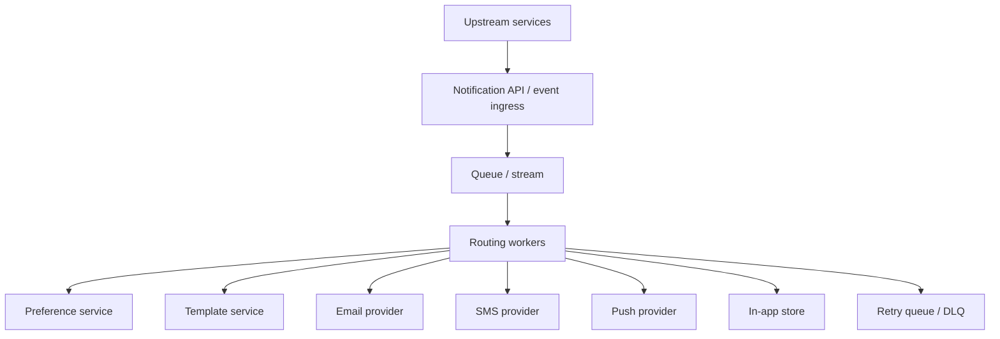

# Worked example: notification service

This example shows how to apply the checklist to an **async, fan-out-heavy backend system**.

## 1. Problem

Design a notification service that can send:

- email
- SMS
- push notifications
- in-app notifications

Typical triggers include order updates, security alerts, and product events.

## 2. Scope assumptions

### In scope

- event ingestion
- user preference checks
- template rendering
- multi-channel delivery
- retry and dead-letter handling

### Out of scope

- full marketing campaign builder
- advanced content experimentation system
- provider contract management

## 3. Requirements

### Functional

- accept notification events from upstream services
- fan out to one or more channels
- honor user preferences and opt-outs
- retry transient failures
- give operators visibility into failures

### Non-functional

- reliable delivery is more important than low single-request latency
- the system must survive provider failures and bursts
- duplicate notifications should be minimized

## 4. High-level design



## 5. Event model

Example event:

```json
{
  "event_id": "evt_123",
  "user_id": "u_42",
  "type": "order_shipped",
  "channels": ["email", "push"],
  "payload": {
    "order_id": "o_99"
  },
  "priority": "normal"
}
```

## 6. Core design decisions

### Queue first

A queue or stream is usually the backbone because:

- fan-out is asynchronous
- providers fail independently
- retry behavior should be decoupled from upstream callers

### Idempotency

You need a deduplication strategy, usually based on:

- `event_id`
- `user_id + type + time window`

without this, retries can easily become duplicate user-visible sends.

## 7. Processing flow

1. upstream service emits notification event
2. ingress validates and writes to queue
3. worker reads event
4. worker fetches user preferences
5. worker resolves channels
6. worker renders template
7. worker calls external provider or in-app store
8. worker records result and schedules retry if needed

## 8. Preferences and policy

Before sending, ask:

- has the user opted out of this channel?
- is this category mandatory (for example, security alerts)?
- do quiet hours apply?
- is there tenant-specific policy?

The preference service can become a hot dependency, so consider caching.

## 9. Template handling

Separate **event semantics** from **channel rendering**.

For example:

- event: `order_shipped`
- email template
- push template
- in-app template

This keeps routing and rendering concerns cleaner.

## 10. Retry strategy

Not every failure should retry the same way.

### Retryable examples

- provider timeout
- transient 5xx response
- temporary rate limiting

### Non-retryable examples

- invalid phone number
- invalid email format
- hard opt-out
- unsupported template data

Use exponential backoff and a dead-letter queue for repeated failures.

## 11. Provider abstraction

Provider wrappers are useful, but do not hide operational detail too aggressively.

Operators still need to know:

- which provider failed
- which response codes are increasing
- whether fallback providers are being used

## 12. Data model ideas

Useful records include:

- notification event metadata
- delivery attempts
- final delivery status
- provider response / error category
- user channel preferences

## 13. Reliability questions

- what if the preference service is slow?
- what if one provider is down but another is healthy?
- what if a bad template breaks many sends at once?
- what if queue backlog grows during a traffic spike?

## 14. Useful metrics

- queue lag / backlog
- success rate by channel
- retry volume by provider
- DLQ growth
- render failures
- opt-out rejection rate
- time-to-delivery percentiles

## 15. Tradeoffs

### Single queue vs per-channel queues

- a single queue is simpler early on
- per-channel queues can isolate provider-specific failure and scaling behavior

### Synchronous API acknowledgment vs fire-and-forget

- synchronous confirmation gives stronger upstream guarantees
- async acceptance is usually simpler and more scalable for notifications

### Shared worker fleet vs channel-specific workers

- shared workers reduce duplication
- channel-specific workers offer stronger isolation and tuning flexibility

## 16. A reasonable first version

A strong first version is often:

- one ingress API
- one durable queue
- routing workers
- cached preference lookup
- channel adapters
- retry queue + DLQ
- dashboards on lag, failures, and delivery latency

That gets you a system that is operationally understandable before you optimize for every edge case.

