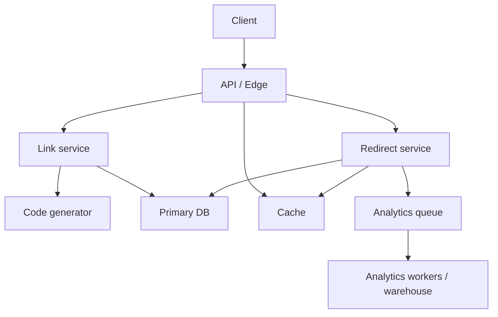

# Worked example: URL shortener

This example shows how to use the checklist on a classic **read-heavy system design** problem.

## 1. Problem

Design a service that:

- accepts a long URL
- returns a short URL
- redirects short URLs quickly and reliably
- optionally records click analytics

## 2. Scope assumptions

### In scope

- short-link creation
- redirect by short code
- basic expiration support
- basic click counting / async analytics

### Out of scope

- custom domains per tenant
- advanced abuse review pipelines
- full real-time analytics product

## 3. Requirements

### Functional

- create short links
- resolve short links
- support expiration
- optionally disable links

### Non-functional

- redirect latency should be very low
- high read / write asymmetry
- links should remain durable
- creation path should avoid collisions

## 4. Back-of-the-envelope scale

Example assumptions:

- 10M new links / month
- 500M redirects / month
- read/write ratio is highly skewed toward reads
- a small number of links may become hot

## 5. APIs

### Create short URL

```text
POST /api/v1/links
{
  "url": "...",
  "ttl": 86400
}
```

### Resolve

```text
GET /{code}
-> 301 / 302 redirect
```

### Disable

```text
POST /api/v1/links/{code}/disable
```

## 6. High-level design



## 7. Data model

One simple relational model:

```text
links(
  code PK,
  original_url,
  created_at,
  expires_at,
  status,
  owner_id nullable
)
```

Possible indexes:

- primary key on `code`
- secondary index on `owner_id` if user link management is required
- secondary index on `expires_at` for cleanup jobs

## 8. Code generation

Common options:

- **global counter + base62**: simple and compact, but central ID generation must scale
- **random tokens**: easy to distribute, but needs collision handling
- **pre-generated pools**: reduces online generation latency, but adds operational complexity

For a straightforward design, a distributed ID generator + base62 encoding is often a good starting point.

## 9. Read path

1. client requests `/{code}`
2. redirect service checks cache
3. on hit, return redirect immediately
4. on miss, fetch from primary DB
5. if valid, populate cache and return redirect
6. emit analytics event asynchronously

### Important questions

- what TTL should cached links use?
- how do we handle expired or disabled links?
- what happens for hot links?

## 10. Write path

1. validate URL
2. generate code
3. store mapping in primary DB
4. return short URL

### Failure considerations

- what if DB write succeeds but response fails?
- do we need idempotency for retries?
- do we allow duplicate long URLs to create different short links?

## 11. Cache strategy

Short-link systems are usually **cache-first on reads**.

Key considerations:

- hot links should stay in cache
- negative caching may help for repeated invalid lookups
- cache stampede protection may be needed for popular links

## 12. Analytics

Analytics is a good place to decouple the main redirect path:

- enqueue click events asynchronously
- aggregate in batch
- accept that analytics may be eventually consistent

Do not put heavy analytics writes directly in the redirect critical path.

## 13. Reliability and operations

Questions to ask:

- what happens if cache is unavailable?
- what is the fallback if analytics queue is down?
- how do we monitor redirect latency and error rate?
- how do we detect abuse or malicious URLs?

Useful metrics:

- redirect QPS
- cache hit rate
- DB read latency
- invalid / expired lookup rate
- queue backlog for analytics

## 14. Tradeoffs

### Relational DB vs KV store

- relational DB is simple and sufficient for many early designs
- KV storage may be attractive once access is almost entirely key-based and scale becomes extreme

### 301 vs 302

- `301` improves cacheability and browser behavior for stable redirects
- `302` is safer when mappings may change

### Strong consistency vs latency

- reads from replicas can reduce latency / load
- but redirect correctness after creation or disable actions may briefly lag

## 15. A reasonable interview answer

If answering this in an interview, a pragmatic version is:

- relational primary store for mappings
- cache in front of reads
- distributed ID generation + base62
- async analytics queue
- metrics on latency, hit rate, and backlog
- explicit handling for hot keys, expired links, and abuse

That is usually stronger than jumping directly to an over-engineered multi-region design.

